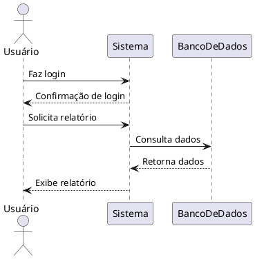
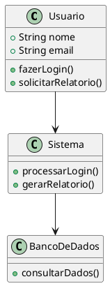
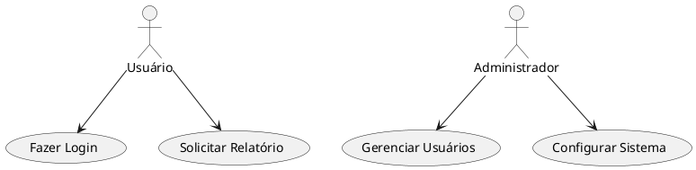

# Documentação de Diagramas com PlantUML

Bem-vindo ao repositório de diagramas do projeto! Este repositório contém os códigos-fonte dos diagramas criados com [PlantUML](https://plantuml.com/), uma ferramenta open-source para gerar diagramas a partir de texto. Usamos a extensão "PlantUML" no Visual Studio Code para criar, visualizar e exportar diagramas diretamente no editor.

## Sobre o PlantUML

PlantUML permite criar diagramas (como de classe, sequência, casos de uso, etc.) usando uma linguagem de marcação simples. Os diagramas são definidos em arquivos de texto com extensão `.puml`, facilitando versionamento e colaboração.

## Pré-requisitos

- **Visual Studio Code**: Instale o VS Code, se ainda não tiver, a partir do [site oficial](https://code.visualstudio.com/).
- **Extensão PlantUML**: Instale a extensão "PlantUML" (de jebbs) no VS Code:
  1. Abra o VS Code.
  2. Vá para a aba de extensões (`Ctrl+Shift+X` ou `Cmd+Shift+X` no macOS).
  3. Pesquise por "PlantUML" e instale a extensão de jebbs.
- **Configuração da Extensão**: A extensão usa um servidor PlantUML (local ou online) para renderizar diagramas. Configure-a, se necessário, nas configurações do VS Code (geralmente funciona automaticamente com o servidor padrão).

## Estrutura do Repositório

- `/diagrams`: Contém os arquivos `.puml` com os códigos dos diagramas.
- `/output`: Contém os diagramas exportados (em PNG, SVG, etc.), se exportados manualmente.

## Como Criar e Visualizar Diagramas

1. **Crie um arquivo `.puml`**:
   - No VS Code, crie um novo arquivo no diretório `/diagrams` com extensão `.puml` (ex.: `diagrama_sequencia.puml`).
2. **Escreva o código do diagrama**:
   - Use a sintaxe do PlantUML. Veja exemplos abaixo.
3. **Visualize o diagrama**:
   - Com o arquivo `.puml` aberto, pressione `Alt+D` (ou o atalho configurado) para abrir a pré-visualização do diagrama.
   - A extensão renderiza o diagrama automaticamente na aba de visualização.
4. **Exporte o diagrama (opcional)**:
   - Clique no ícone de exportação na pré-visualização (ou use o comando `PlantUML: Export Current Diagram` no VS Code).
   - Escolha o formato (PNG, SVG, etc.) e salve no diretório `/output`.

## Exemplos de Diagramas

### 1. Diagrama de Sequência
Descreve a interação entre objetos ou atores em um fluxo.

**Arquivo**: `diagrams/diagrama_sequencia.puml`

### 2. Diagrama de Classe
Mostra a estrutura estática de classes e suas relações.

**Arquivo**: `diagrams/diagrama_classe.puml`

### 3. Diagrama de Caso de Uso
Mostra atores e casos de uso do sistema.

**Arquivo**: `diagrams/diagrama_caso_uso.puml`

## Dicas

- **Pré-visualização em Tempo Real**: A extensão atualiza a pré-visualização automaticamente ao editar o arquivo `.puml`.
- **Formatos de Saída**: Exporte diagramas em PNG, SVG ou outros formatos diretamente pela extensão.
- **Documentação Oficial**: Consulte o [guia do PlantUML](https://plantuml.com/) para mais tipos de diagramas (atividade, estado, etc.).
- **Organização**: Mantenha os arquivos `.puml` em `/diagrams` e os resultados exportados em `/output` para facilitar o versionamento.

## Contribuindo

1. Crie um novo arquivo `.puml` no diretório `/diagrams`.
2. Escreva o código do diagrama usando a sintaxe do PlantUML.
3. Visualize o diagrama com a extensão (`Alt+D`).
4. Exporte a imagem, se necessário, e salve em `/output`.
5. Faça commit do arquivo `.puml` e, se desejar, da imagem exportada.